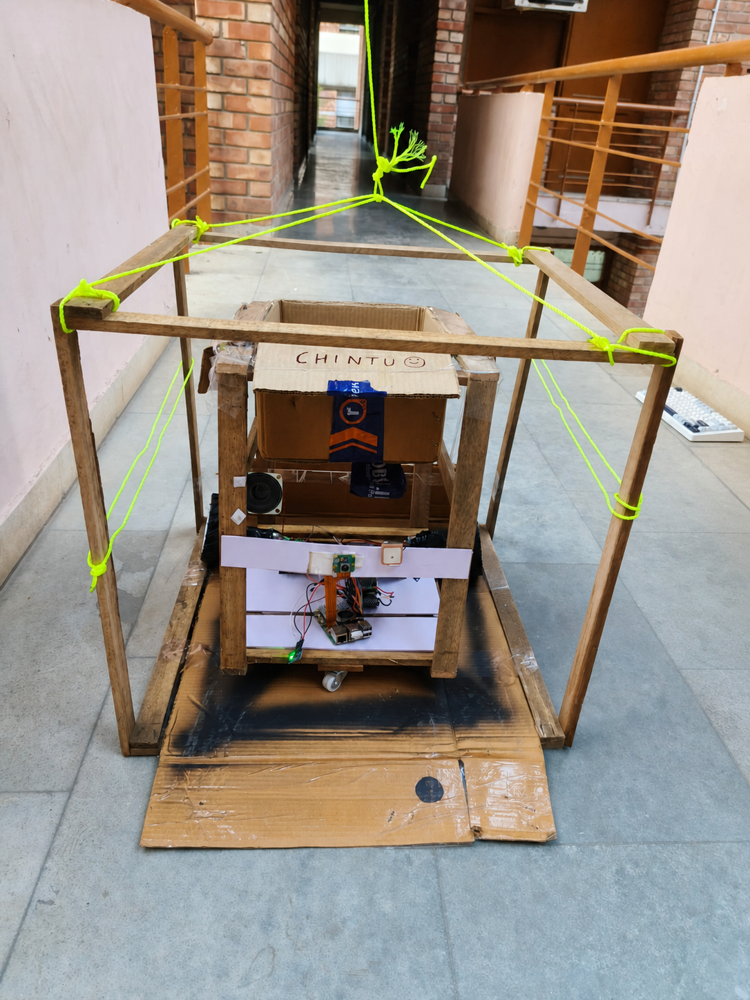

# Max

**Max turns a Telegram request into a Swiggy Instamart order, an approved Prava
payment, and a physical pickup completed by a Raspberry Pi robot.**

Send Max what you need. It finds the item, presents the exact purchase for
approval, completes checkout, follows the delivery, rides its pulley platform
down when the rider reaches the gate, collects the package, and brings it back
up to you.

▶ **[Watch the full Max demo on YouTube](https://www.youtube.com/watch?v=0w4cCR9zJCQ)**



*Max inside the pulley platform that carries it up and down between floors.*

▶ **[Max leaving the hostel on a mission](docs/assets/max-leaving-hostel.mp4)**

## From request to return

```text
Private Telegram chat
        |
        v
OpenAI interpretation -> persisted Max mission workflow
        |                         |
        |                         +-> Mission Control dashboard
        v
Live Instamart quote -> Prava owner approval -> Swiggy checkout
                                                |
                                                v
                              Swiggy MCP order-status polling
                                                |
                           verified arrival event only
                                                v
                                    authenticated Pi job
                                                |
                                                v
                         ROS 2 + VSLAM + obstruction safety
                                                |
                                                v
                              stationary pulley checkpoint
                                                |
                                                v
                                       ESP32 moves DOWN
                                                |
                                                v
                                  navigate to gate pickup
                                                |
                                                v
                                  package secured on robot
                                                |
                                                v
                                  reverse route to pulley
                                                |
                                                v
                                        ESP32 moves UP
                                                |
                                                v
                                      package reaches owner
```

Every transition is persisted and reflected in Telegram and Mission Control,
from clarification and approval through delivery, pickup, return, cancellation,
and completion.

## Inside Max

- **Telegram** is the private owner interface for requests, clarification, the
  Prava approval link, payment results, delivery progress, and robot updates.
- **The Max workflow** keeps the quote, approval, payment, checkout, order, and
  robot lifecycle connected as one mission.
- **Swiggy Instamart** provides live product and order data through
  `get_orders`/`track_order`; only the correlated arrival event dispatches Max.
- **Prava** binds owner approval to the exact purchase before checkout.
- **The Raspberry Pi agent** connects outbound to the backend, reports hardware
  health, receives authenticated jobs, and synchronizes the pickup lifecycle.
- **ROS 2 and RTAB-Map** provide visual SLAM, measured odometry, AprilTag route
  checkpoints, obstruction handling, motor watchdogs, and emergency stopping.
- **The ESP32 pulley controller** moves the platform down and up through a
  BTS7960, with normally-closed limits, keepalives, timeouts, and latched faults.

Max has completed this flow as a physical system. Secrets, OAuth sessions,
route maps, GPIO assignments, and calibration values are specific to each Max
installation and stay outside the repository.

## Design

OpenAI interprets the owner's request; the persisted workflow owns authority.
The backend decides when an order may dispatch, while the Pi decides whether
local motion is safe. Payment, delivery arrival, navigation, and pulley movement
each advance only from their corresponding verified state.

[Agent API →](apps/api/README.md) · [Telegram deployment →](docs/TELEGRAM-BACKEND.md) · [Mission Control →](apps/web/README.md)

[Swiggy-to-Pi bridge →](docs/ORDER-STATUS-BRIDGE.md) · [Navigation →](docs/mohit/NAVIGATION.md) · [Pulley firmware →](firmware/pulley_controller/README.md) · [Physical setup →](docs/PHYSICAL-ROBOT-DEMO.md)

## Why Max

Max treats commerce and physical fulfilment as one continuous mission. The same
state connects the purchase its owner approved to the order being delivered and
the robot carrying it home.

Built for the [Agentic Commerce Hackathon](https://agentic-commerce.devfolio.co/overview).

## Run it

First-time dependency setup:

```bash
./scripts/setup.sh
```

After configuring `.env`, Swiggy OAuth, and the dedicated checkout browser:

```bash
./scripts/dev.sh
```

[Read the complete setup, test, restart, and troubleshooting guide →](docs/RUN.md)

[Commission and run the physical autonomous demo →](docs/PHYSICAL-ROBOT-DEMO.md)

Scripts: [setup](scripts/setup.sh) · [start/stop development](scripts/dev.sh)

## Repository layout

```text
apps/
├── api/          # Max agent, mission workflow, persistence, integrations
│   ├── max_api/
│   ├── migrations/
│   └── tests/
├── web/          # Mission Control dashboard
│   └── src/
├── robot/        # Raspberry Pi ROS 2/VSLAM, safety, and pulley integration
└── blinkit-mcp/  # retained unofficial experiment; not part of the Max flow
firmware/
└── pulley_controller/ # fail-closed ESP32 pulley controller
docs/             # shared project and operating documentation
scripts/          # dependency setup and local process launcher
```
