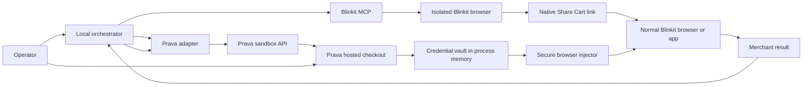

# Blinkit MCP + Prava Implementation Plan

## 1. Objective

Build and validate this controlled hybrid flow:

```text
Blinkit MCP
→ authenticate and select a saved address
→ search products and build a reviewed cart
→ generate Blinkit's native Share Cart link
→ import the cart into the operator's normal Blinkit browser/app
→ recheck the complete Blinkit quote and new-card form
→ create an exact Prava sandbox session
→ complete Prava approval in a passkey-capable browser
→ place Prava's scoped credential into Blinkit's unsaved-card form
→ submit exactly once after explicit operator confirmation
→ reconcile Blinkit and Prava terminal states
```

The first production milestone is a safe, repeatable sandbox validation. It is
not autonomous purchasing.

## 2. Evidence already available

The current implementation has proven:

- Blinkit phone/OTP login and session persistence work.
- Saved-address selection, live search, cart mutation, quote parsing, checkout
  navigation, and payment-method inspection work.
- Blinkit exposes a new credit/debit-card path.
- Cart mutations made in the MCP's isolated browser do not automatically appear
  in a separately opened Blinkit app or website session.
- Blinkit's native Share Cart action generates a working `link.blinkit.com` URL.
- The new `share_cart` MCP tool generates that native link.
- Prava sandbox session creation works.
- Prava correctly receives an INR total when monetary values are sent as strings.
- A consolidated Prava line displays Blinkit's complete payable amount.
- Prava currently fails during Visa initialization in the Codex Electron browser
  with `AUTH_NOT_SUPPORTED: FIDO not available on this device`.
- The same Prava page also logs `GET /v1/cards` returning HTTP 500.
- No Blinkit order or payment has been submitted during testing.

## 3. Recommended architecture



### Component responsibilities

| Component | Responsibility | Must not do |
| --- | --- | --- |
| Blinkit MCP | Login, address selection, search, cart mutation, quote, share link, read-only checkout inspection | Submit payment without confirmation |
| Local orchestrator | Run the state machine, enforce gates, compare immutable purchase data, coordinate results | Store payment credentials or silently retry |
| Prava adapter | Create/poll/report sandbox sessions and normalize states | Expose secrets or network credentials to logs/chat |
| Normal browser/app | Hold the user-visible imported Blinkit cart and merchant card form | Reuse a credential or save the test card |
| Secure injector | Move Prava credential fields from protected memory to the Blinkit form | Return credential values to the LLM or filesystem |
| Operator | Approve passkey/user-presence steps and final one-time merchant submission | Paste secrets, OTPs, or card values into chat |

## 4. Core design decisions

### 4.1 Hybrid instead of MCP-only

Use the MCP for deterministic commerce operations and structured output. Use a
normal browser/app for the cross-device cart and payment surface. The isolated
MCP browser cannot guarantee that its cart appears in the user's existing app.

### 4.2 Native Share Cart as the handoff contract

Treat the share link as an explicit handoff, not proof of synchronization. After
the operator opens/imports it, fetch the receiving cart again and compare every
purchase field before creating or using a Prava credential.

### 4.3 Passkey-capable browser is mandatory

Do not use the Codex Electron browser for Prava approval until Prava confirms
support or provides a non-FIDO fallback. Use normal Chrome/Safari/Edge with a
working platform authenticator, or a Prava-supported external approval flow.

### 4.4 Credentials never enter the model context

Prava network token, expiry, and cryptogram/CVV remain in a short-lived local
vault. The secure injector consumes them directly and returns only booleans and
redacted state such as `fields_present=true` and `submission_attempted=true`.

### 4.5 Explicit single-submit gate

The final Blinkit payment click requires a fresh operator confirmation showing
merchant, address label, item summary, currency, total, and the statement that
the action may create an order. A timeout or unknown result is never retried
until Blinkit order history proves that no order exists.

## 5. Target state machine

```text
IDLE
→ BLINKIT_AUTHENTICATED
→ ADDRESS_SELECTED
→ CART_PREPARED
→ CART_REVIEWED
→ SHARE_LINK_CREATED
→ CART_IMPORTED
→ BROWSER_QUOTE_VERIFIED
→ CARD_FORM_VERIFIED
→ PRAVA_SESSION_CREATED
→ PRAVA_APPROVAL_PENDING
→ PRAVA_AWAITING_RESULT
→ PURCHASE_RECHECKED
→ SUBMISSION_CONFIRMED
→ MERCHANT_SUBMITTED_ONCE
→ MERCHANT_TERMINAL
→ PRAVA_REPORTED
→ RECONCILED
```

Terminal failure states:

- `ADDRESS_UNAVAILABLE`
- `CART_IMPORT_FAILED`
- `QUOTE_MISMATCH`
- `CARD_FORM_UNAVAILABLE`
- `PRAVA_AUTH_UNSUPPORTED`
- `PRAVA_EXPIRED`
- `OPERATOR_CANCELLED`
- `MERCHANT_DECLINED`
- `MERCHANT_UNKNOWN`
- `UNEXPECTED_ORDER_CREATED`

Every transition must record a timestamp and redacted evidence. Only one
transition may cause the Blinkit payment submission.

## 6. Implementation phases

### Phase 0 — Confirm Prava support requirements

Tasks:

1. Send Prava support the existing session ID and FIDO diagnostics.
2. Confirm supported browsers, embedded-browser policy, RP ID/origin
   requirements, and whether external/system-browser approval is supported.
3. Confirm whether `/v1/cards` HTTP 500 is expected for a new sandbox user.
4. Confirm the exact lifecycle states and result-reporting endpoint.
5. Confirm credential lifetime, single-use behavior, and required merchant
   decline reporting.
6. Obtain a documented non-FIDO fallback or mark a platform authenticator as a
   mandatory test prerequisite.

Exit criteria:

- A supported approval browser/device is identified.
- The expected state sequence through credential readiness is documented.
- `AUTH_NOT_SUPPORTED` has a supported resolution or explicit stop condition.

### Phase 1 — Freeze domain contracts

Create internal redacted models:

```text
CartSnapshot
  merchant
  merchant_url
  address_label
  items[]: product_id, name, variant, unit_price, quantity, line_total
  fees[]: type, amount
  discounts[]: type, amount
  currency
  total
  observed_at

PravaSessionRef
  session_id_redacted
  order_id_redacted
  amount
  currency
  state
  expires_at

MerchantAttempt
  attempt_id
  confirmed_at
  submitted_at
  classification
  order_reference_redacted
```

Rules:

- Money uses integer paise internally and decimal strings at the Prava API.
- The sum of product lines, fees, and discounts must equal the final total.
- Full addresses, phone numbers, coordinates, cookies, tokens, expiry, and
  cryptograms are excluded from serializable models.
- State transitions are monotonic; terminal states cannot be retried in place.

Exit criteria:

- Unit tests cover money conversion, total reconciliation, redaction, and state
  transition rejection.

### Phase 2 — Harden the Blinkit MCP surface

Keep the existing 15 tools and add only the structured fields needed by the
orchestrator.

Tasks:

1. Make `check_cart` optionally return a structured `CartSnapshot` while
   preserving the human-readable response.
2. Include product IDs, variants, unit prices, quantities, fee categories,
   discounts, total, currency, address label, and observation timestamp.
3. Keep `share_cart` based on Blinkit's native Share control.
4. Return a typed error when the cart is empty, Share is absent, clipboard
   access fails, or the link format is invalid.
5. Add a read-only `inspect_checkout` operation that reports available payment
   methods and whether an unsaved-card form exists. It must not submit.
6. Add selector fallbacks only when a live regression test proves they are
   needed.
7. Preserve stdout isolation so browser logs cannot corrupt MCP JSON-RPC.

Tests:

- Static registration/manifest test for all tools.
- Unit tests for share-link parsing and error paths.
- Live search/add/cart/share smoke test.
- Live empty-cart Share failure test.
- Live address/store-unavailable test.

Exit criteria:

- A two-item Home-address cart produces a valid share URL.
- No MCP tool exposes full address details or payment secrets.
- No checkout/payment submission occurs in the test suite.

### Phase 3 — Implement cart import and parity verification

MVP path:

1. MCP generates the share link.
2. Operator opens it in the normal Blinkit browser/app.
3. Operator accepts the import if Blinkit prompts.
4. Browser automation reads the receiving cart.

Production path:

- Use an attached Chrome browser so automation can open the link and inspect the
  same user-visible session. Mobile-only import remains a manual step unless an
  Android Appium implementation is deliberately added later.

Parity checks:

- Address label
- Product identity and variant
- Quantity
- Unit and line prices
- Fees and discounts
- Currency
- Final payable total
- Store/serviceability status

Behavior on mismatch:

- Stop before creating Prava credentials.
- Show a field-by-field diff.
- Allow rebuilding a fresh share cart, but never silently mutate the receiving
  cart to force a match.

Exit criteria:

- Two consecutive fresh tests import the same products and produce an exact
  receiving-cart match.

### Phase 4 — Build the Prava adapter

Expose a narrow internal interface:

```text
create_session(cart_snapshot) -> PravaSessionRef
get_state(session_ref) -> normalized_state
acquire_credential(session_ref) -> protected_handle
report_result(session_ref, merchant_result)
```

Tasks:

1. Read the sandbox secret from environment/secret storage only.
2. Validate that the key is a sandbox key before making a request.
3. Send `total_amount` and `unit_price` as two-decimal strings.
4. Map the cart into product/fee lines whose arithmetic equals the total.
5. Until Prava fixes its hosted display, support a presentation mode that sends
   one consolidated `Blinkit order` line at the exact payable total.
6. Store the raw session token and approval URL only in process memory.
7. Poll with bounded backoff until a terminal/ready state or expiry.
8. Normalize Prava errors into stable codes, including
   `AUTH_NOT_SUPPORTED`, `SESSION_EXPIRED`, and `CARDS_API_FAILED`.
9. Redact error payloads before they reach logs or MCP responses.

Exit criteria:

- Contract tests validate request types, arithmetic, redaction, expiry, and
  provider-error normalization.
- A session for the verified Blinkit total displays that exact total in Prava.

### Phase 5 — Approval browser integration

Tasks:

1. Open Prava's hosted approval URL in a supported normal browser.
2. Verify merchant name, currency, and total before user interaction.
3. Complete sandbox card enrollment, sandbox OTP, and passkey only through the
   user-controlled browser.
4. Treat CAPTCHA, biometric, passkey, and system permission prompts as manual
   user-presence steps.
5. Poll Prava independently; do not scrape credentials from the visible page.
6. On `AUTH_NOT_SUPPORTED`, stop and emit the diagnostic bundle already proven
   useful: session ID, browser, timestamp, provider state, and redacted console
   codes.

Exit criteria:

- Two fresh sessions reach Prava's credential-ready state on a supported device.
- No sensitive value appears in chat, terminal output, screenshot, or files.

### Phase 6 — Secure credential bridge

This is the highest-risk implementation phase.

Tasks:

1. Create a memory-only credential vault owned by a local trusted process.
2. Represent credentials externally as opaque handles, never strings.
3. Allow the browser injector to consume a handle exactly once.
4. Bind each handle to merchant, currency, amount, Prava session, and expiry.
5. Reject injection if the current Blinkit quote differs from that binding.
6. Fill only the unsaved-card form and explicitly disable save-card.
7. Return only redacted results: fields found, fields filled, save-card disabled,
   and handle consumed.
8. Zero/delete the credential object immediately after use or expiry.
9. Prevent screenshots, tracing, HAR capture, clipboard use, and verbose browser
   logs during credential handling.

Exit criteria:

- Automated tests prove that credentials cannot be serialized or logged.
- A fake credential can traverse vault → injector without the test process
  printing its value.
- Reusing a consumed or expired handle fails closed.

### Phase 7 — One-time Blinkit submission and reconciliation

Pre-submit gate:

1. Re-read the Blinkit cart and payment page.
2. Compare it against the approved `CartSnapshot`.
3. Verify the Prava credential is unused and unexpired.
4. Verify save-card is disabled.
5. Ask for explicit confirmation containing merchant, address label, item count,
   and total.

Submission:

- Click once.
- Record the attempt ID and timestamp before clicking.
- Disable further submissions immediately.
- Classify the visible result as `DECLINED`, `FAILED`, `CANCELLED`, `PENDING`,
  `UNKNOWN`, or `SUCCESS`.

Reconciliation:

- Check the visible Blinkit result.
- Inspect Blinkit order history read-only.
- Report `DECLINED` to Prava only after a confirmed merchant decline.
- On timeout/ambiguity, record `UNKNOWN`, do not retry, and do not report a
  guessed result.
- If Blinkit reports success, stop and use the legitimate cancellation/support
  workflow; never conceal the created order.

Exit criteria:

- One fresh sandbox attempt reaches a known terminal merchant result.
- Prava's final state matches the reported merchant result.
- No real successful order remains unresolved.

### Phase 8 — Observability and audit trail

Record:

- Correlation ID
- Redacted Blinkit cart/share/attempt IDs
- Redacted Prava session/order IDs
- State transitions and timestamps
- Merchant, currency, amount, item count
- Provider/browser error codes
- Explicit-confirmation timestamp
- Submission count

Never record:

- Phone number or OTP
- Full address or coordinates
- Cookies or access tokens
- Prava API/session secrets
- Network token, expiry, cryptogram, CVV, or passkey data
- Payment-form screenshots or browser traces containing credentials

Add a redaction test with seeded fake secrets that fails if any seeded value
appears in logs or generated reports.

### Phase 9 — Release and rollout

Release levels:

1. **Read-only:** search, cart quote, checkout inspection.
2. **Handoff:** generate and verify native Share Cart links.
3. **Prava approval:** create/poll sessions; no merchant credential entry.
4. **Credential injection:** fake credentials only.
5. **Sandbox submission:** explicit confirmation, one attempt.
6. **Production consideration:** separate security and legal review; disabled by
   default.

Feature flags:

- `BLINKIT_SHARE_CART_ENABLED`
- `PRAVA_SANDBOX_ENABLED`
- `PRAVA_CREDENTIAL_INJECTION_ENABLED`
- `BLINKIT_PAYMENT_SUBMISSION_ENABLED`

The final two flags default to false and require an operator-controlled local
configuration change.

## 7. Test matrix

| Area | Test | Expected result |
| --- | --- | --- |
| Auth | Saved Blinkit session valid | Account detected without OTP |
| Auth | Expired session | Explicit login required; no false success |
| Address | Saved Home selected | Correct label; no full address logged |
| Search | Common in-stock product | Stable ID/name/price returned |
| Cart | Two products and fees | Arithmetic equals total |
| Handoff | Share link generated | `link.blinkit.com` URL, HTTP 200 |
| Handoff | Link opened in normal browser/app | Import prompt/cart appears |
| Parity | Imported cart unchanged | Exact match |
| Parity | Price or stock changes | `QUOTE_MISMATCH`, flow stops |
| Checkout | New-card option present | Unsaved-card form detected |
| Prava | Exact session request | String money fields, matching INR total |
| Prava | Unsupported Electron browser | `PRAVA_AUTH_UNSUPPORTED`, no retry |
| Prava | Supported browser/passkey | Reaches credential-ready state |
| Security | Seeded fake credential | Never appears in logs/files/chat |
| Injector | Expired/used handle | Rejected |
| Submission | Operator cancels | Zero merchant attempts |
| Submission | Confirmed decline | Exactly one attempt, no order |
| Submission | Timeout | `UNKNOWN`, no automatic retry |
| Reconciliation | Unexpected success | Stop, preserve order reference, support path |

## 8. Definition of done

The sandbox implementation is complete only when all are true:

- [ ] Prava confirms a supported approval browser/device or fallback.
- [ ] Share Cart imports into the operator-visible Blinkit session.
- [ ] Imported cart parity is checked automatically.
- [ ] Blinkit exposes an unsaved-card form before order creation.
- [ ] Prava reaches credential-ready state twice on fresh sessions.
- [ ] Credentials remain outside model, logs, files, clipboard, and screenshots.
- [ ] Save-card is disabled.
- [ ] Immutable purchase recheck passes immediately before submission.
- [ ] Exactly one explicitly confirmed merchant submission occurs.
- [ ] Blinkit reaches a known terminal state.
- [ ] Blinkit order history confirms whether an order exists.
- [ ] Prava receives only the confirmed merchant result.
- [ ] All static, contract, live smoke, redaction, and state-machine tests pass.
- [ ] The dated test report contains redacted evidence and deviations.

## 9. Recommended delivery order

| Order | Deliverable | Size | Dependency |
| ---: | --- | :---: | --- |
| 1 | Prava support/browser decision | S | External support |
| 2 | Structured `CartSnapshot` and parity comparator | M | None |
| 3 | Hardened `share_cart` and receiving-browser verifier | M | Attached browser |
| 4 | Prava adapter and state normalization | M | Current Prava API |
| 5 | External approval-browser flow | M | Prava browser support |
| 6 | Memory-only credential bridge | L | Security review |
| 7 | One-submit orchestrator and reconciliation | L | All earlier phases |
| 8 | Full sandbox run and dated evidence | M | Stable end-to-end flow |

## 10. Immediate next actions

1. Wait for Prava's response on FIDO/Electron support and `/v1/cards` HTTP 500.
2. Add structured cart output and a field-by-field parity comparator.
3. Attach a normal Chrome session and validate Share Cart import there.
4. Create the Prava adapter behind sandbox-only configuration.
5. Stop before credential injection until Prava approval reaches its documented
   ready state in a supported browser.
